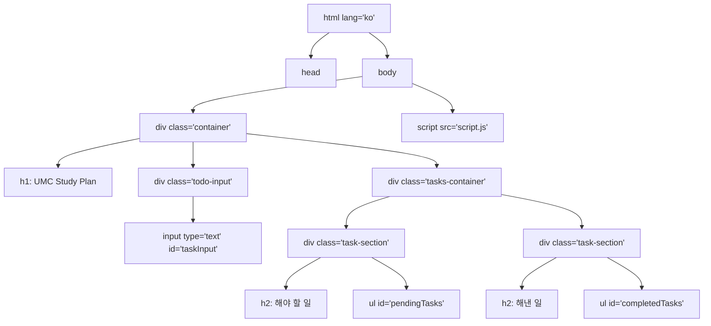

## 파일 구조
- `index.html` - 기본 HTML 구조
- `styles.css` - 스타일 정의
- `script.js` - 기능 구현

### HTML 주요 요소
- `container`: 전체 앱 컨테이너
- `todo-input`: 사용자 입력 영역
- `tasks-container`: 해야 할 일과 해낸 일을 담는 컨테이너
- `task-section`: 각 섹션 (해야 할 일/해낸 일)
- `pendingTasks`: 해야 할 일 목록
- `completedTasks`: 해낸 일 목록

### 기본 스타일 및 레이아웃
- 전체 요소에 대한 기본 설정 (margin, padding, box-sizing)
- 반응형 레이아웃을 위한 컨테이너 스타일 (width: 60%, height: 60%)
- Flexbox를 활용한 레이아웃 배치

### 컴포넌트별 스타일
- 헤더 스타일 (h1, h2)
- 입력 필드 스타일 (`#taskInput`)
- 할 일 섹션 스타일 (`.task-section`)
- 리스트 아이템 스타일 (`li`, `.task-text`)
- 버튼 스타일 (`.complete-btn`, `.delete-btn`)

### 주요 CSS 특징
- Flexbox를 활용한 레이아웃
- 부드러운 그림자 효과 (box-shadow)
- 호버 효과가 있는 버튼
- 깔끔한 색상 체계
- 둥근 모서리 (border-radius)

## JavaScript 구조 (script.js)

### 데이터 관리
- localStorage를 사용하여 할 일 데이터 영구 저장
- 할 일 객체 배열 (task 객체는 text와 completed 속성을 가짐)

### DOM 조작
- `renderTasks()`: 할 일 목록을 화면에 표시
- 동적 요소 생성 (버튼, 텍스트 등)
- 이벤트 리스너 연결

### 주요 기능
1. **할 일 추가 기능**:
   - Enter 키를 누르면 입력된 할 일이 '해야 할 일' 목록에 추가됨
   - 빈 문자열은 추가되지 않음

2. **완료 기능**:
   - '해야 할 일'에서 '완료' 버튼을 누르면 해당 항목이 '해낸 일'로 이동
   
3. **삭제 기능**:
   - '해낸 일'에서 '삭제' 버튼을 누르면 해당 항목이 목록에서 제거됨

### 이벤트 처리
- `keypress` 이벤트: Enter 키로 할 일 추가
- 버튼 클릭 이벤트: 완료 및 삭제 동작 처리

## 전체 앱 흐름
1. 페이지 로드 시 localStorage에서 기존 할 일 데이터 불러옴
2. 사용자가 할 일을 입력하고 Enter 키를 누르면 새로운 할 일 추가
3. '해야 할 일' 목록에서 '완료' 버튼을 누르면 해당 항목이 '해낸 일'로 이동
4. '해낸 일' 목록에서 '삭제' 버튼을 누르면 해당 항목 삭제
5. 모든 변경사항은 localStorage에 저장되어 페이지 새로고침 후에도 유지